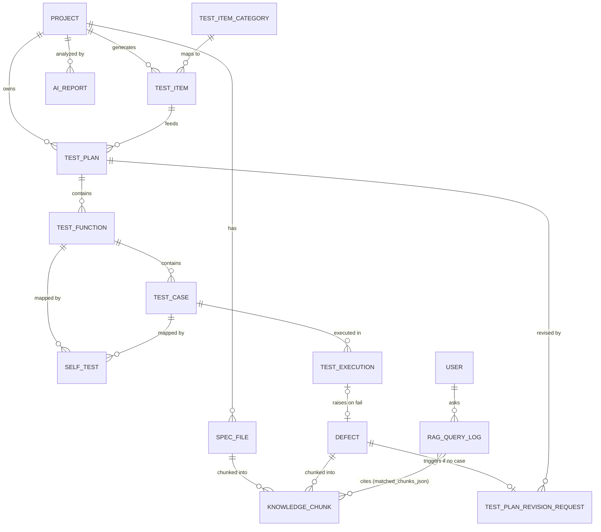
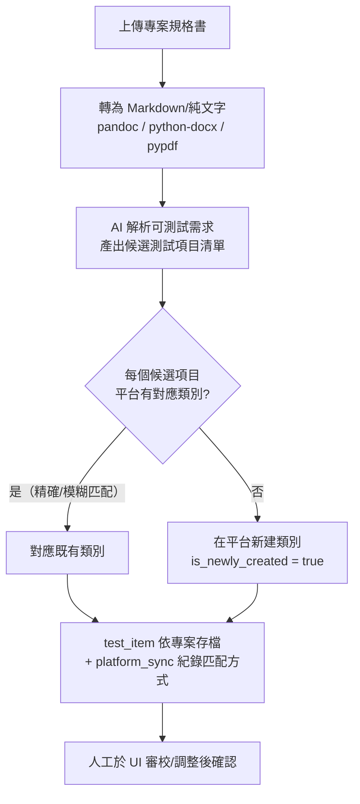
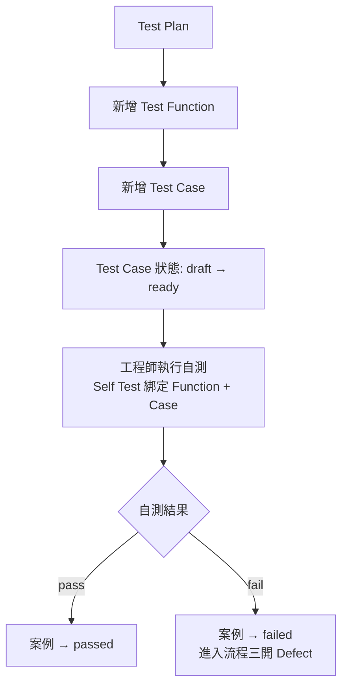
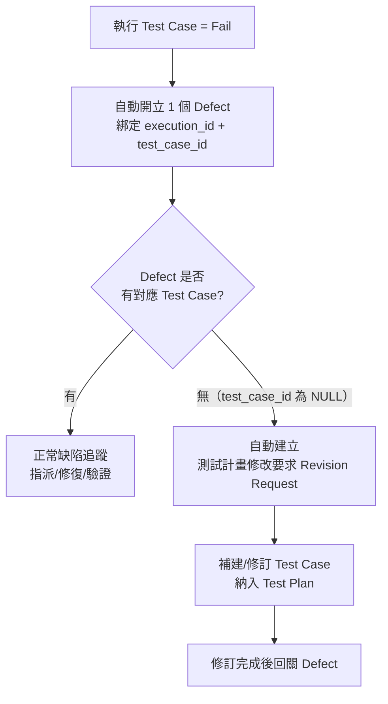
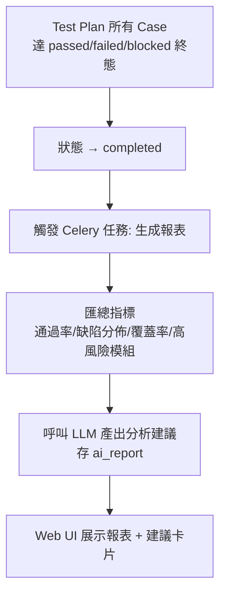
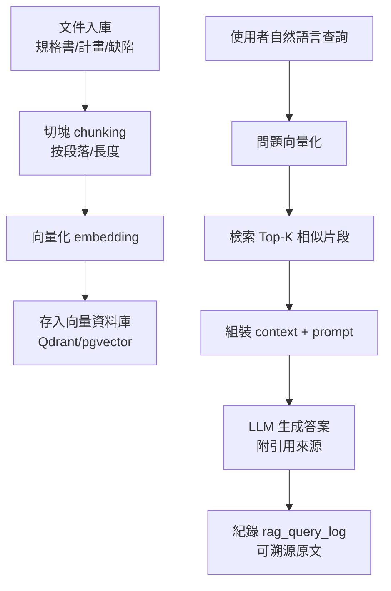

# TestWeaver 測試管理平台 — 程式計劃書

| 項目 | 內容 |
| --- | --- |
| 專案名稱 | TestWeaver 測試管理平台 |
| 文件版本 | v1.0 |
| 文件狀態 | 初稿 / 供評審 |
| 撰寫日期 | 2026-07 |
| 技術棧 | Web UI (React) + Python (FastAPI) + MySQL |

---

## 0. 版本記錄

| 版本 | 日期 | 作者 | 變更說明 |
| --- | --- | --- | --- |
| v1.0 | 2026-07 | — | 首次提出，涵蓋全部五項功能需求 |
| v1.1 | 2026-07 | — | 補充 RAG：向量庫取捨（§3.4）、檢索器設定參數（§8.1）；新增 RAG 模型與 Alembic 遷移 |

---

## 1. 專案概述

### 1.1 背景與目的

現有測試流程多以人工維護 Excel / 文件為主，存在以下痛點：

- 測試項目散落在各專案，缺乏統一的「共通類別平台」可復用與對齊。
- 測試計畫（Test Plan）→ 測試功能（Test Function）→ 測試案例（Test Case）層級結構不一致，自測難以回溯對應。
- 測試失敗後的缺陷（Defect）追蹤與「缺少對應測試案例」的情況缺乏自動補件機制。
- 測試結束後缺少自動化的報表與 AI 分析建議，回饋週期長。

本專案旨在建立一套 **Web 化的測試管理平台**，達成：規格書 → 測試項目自動產生、層級化測試計畫管理、缺陷追蹤與測試計畫修改要求自動補件、完成後自動報表與 AI 分析。

### 1.2 範圍（In Scope）

1. 讀取專案規格書，自動產生測試項目，並依專案分離；測試項目必須由「共通類別平台」衍生，平台不存在時先在平台新建再對應。
2. 管理 `Test Plan → Test Function → Test Case` 三層結構，並讓「自測」對應到 Test Function 與 Test Case。
3. 每個測試失敗自動開立 1 個 Defect；Defect 無對應 Test Case 時，自動建立「測試計畫修改要求」。
4. 測試完成時生成報表與 AI 分析建議。
5. 提供 Web UI 操作介面，後端 Python、資料庫 MySQL。

### 1.3 非範圍（Out of Scope，本階段暫不含）

- 自動化測試腳本的實際執行引擎（僅管理與追蹤，不負責跑自動化腳本）。
- 跨公司的單一登入 / SSO 整合（先做本地帳號登入）。
- 多語言 UI（先以中文為主，介面文字可後續 i18n）。

---

## 2. 需求分析

### 2.1 功能性需求（對應五點需求）

| 編號 | 需求 | 說明 |
| --- | --- | --- |
| FR-1 | 規格書解析與測試項目產生 | 上傳專案規格書（docx/pdf/txt/md），AI 解析出候選測試項目；依專案分離存放。 |
| FR-1a | 共通類別平台衍生 | 每個測試項目必須對應平台類別；平台無對應時，先「新建平台類別」再對應，並標記 `is_newly_created`。 |
| FR-2 | 三層測試結構 | Test Plan 含多個 Test Function，Test Function 含多個 Test Case。 |
| FR-2a | 自測對應 | 自測（Self Test）紀錄必須同時對應到 Test Function 與 Test Case。 |
| FR-3 | 失敗開 Defect | 任一 Test Case 執行結果為 Fail，自動開立 1 個 Defect。 |
| FR-3a | 無案例則補件 | Defect 若無對應 Test Case（`test_case_id` 為空），自動建立「測試計畫修改要求」（Test Plan Revision Request）。 |
| FR-4 | 完成報表與 AI 分析 | 測試計畫狀態轉為「完成」時，觸發報表生成與 AI 分析建議。 |
| FR-5 | Web UI | 提供完整操作介面；後端 Python（FastAPI）、資料庫 MySQL。 |
| FR-6 | RAG 查詢 / 智能檢索 | 對規格書、測試計畫、缺陷建立向量索引，提供自然語言查詢（檢索增強生成）；AI 生成測試項目 / 分析時以檢索片段作為依據，降低幻覺並可溯源。 |

### 2.2 非功能性需求

| 類別 | 要求 |
| --- | --- |
| 效能 | 單次報表 / AI 分析任務（含 LLM 呼叫）目標 < 60s，以非同步排程執行。 |
| 並發 | 支援同時 ≥ 20 位使用者操作；AI 任務使用佇列並行。 |
| 可用性 | 服務可用率 ≥ 99%；狀態可重啟恢復。 |
| 安全 | JWT 驗證；角色權限（Admin / Manager / Engineer）；敏感設定環境變數化。 |
| 可擴充 | LLM Provider、檔案解析器皆以介面抽象，可替換。 |
| 日誌 / 稽核 | 關鍵操作（新增 Defect、修改計畫）留稽核紀錄。 |
| 可移植 | Docker / docker-compose 一鍵部署。 |

---

## 3. 系統架構

### 3.1 整體架構

```
┌───────────────────────────────────────────────────────────────┐
│                        瀏覽器 (Web UI)                          │
│        React + TypeScript + Ant Design + ECharts (報表)         │
└───────────────┬───────────────────────────────────────────────┘
                │  HTTP/JSON (REST) + JWT
┌───────────────▼───────────────────────────────────────────────┐
│                     後端 API 層 (FastAPI)                       │
│  ┌────────────┬───────────────┬───────────────┬─────────────┐  │
│  │ 規格/項目    │ 測試計畫管理    │ 缺陷追蹤      │ 報表/AI     │  │
│  │ Spec/Item   │ Plan/Func/Case│ Defect/RevReq │ Report/AI   │  │
│  └────────────┴───────────────┴───────────────┴─────────────┘  │
│   Service 層（業務邏輯）  →  Repository/ORM 層 (SQLAlchemy)      │
└───────┬──────────────────────────────┬───────────────┬─────────┘
        │                              │               │
┌───────▼────────┐   ┌─────────────────▼──────┐  ┌─────▼──────────┐
│   MySQL 8.0     │   │  Redis (快取/佇列 Broker) │  │  AI 服務       │
│   主要資料庫     │   │  + Celery Worker        │  │  LLM API       │
└────────────────┘   └────────────┬───────────┘  │  (OpenAI/本地) │
                                   │              └────────────────┘
                          ┌────────▼───────────┐
                          │  AI 工作器 (Celery)  │
                          │ - 解析規格→生成項目   │
                          │ - 報表 + AI 分析     │
                          └────────────────────┘
```

> **RAG 資料流**：規格書 / 測試計畫 / 缺陷文件切塊（chunking）→ 向量化（embedding）→ 存入向量資料庫；查詢時先檢索 Top-K 相似片段，再交給 LLM 生成答案，減少幻覺並可溯源到原文。

### 3.2 技術選型

| 層 | 技術 | 說明 |
| --- | --- | --- |
| 前端 | React 18 + TypeScript + Vite | 單頁應用，元件化。 |
| UI 套件 | Ant Design | 表格 / 表單 / 樹形結構（三層計畫）開箱即用。 |
| 圖表 | ECharts | 測試結果、缺陷趨勢、覆蓋率報表。 |
| 狀態管理 | Zustand（或 TanStack Query） | 輕量，API 快取。 |
| 後端框架 | FastAPI (Python 3.12) | 非同步、自動 OpenAPI 文件、型別檢查。 |
| ORM / 遷移 | SQLAlchemy 2.x + Alembic | 資料庫模型與版本遷移。 |
| 驗證 / 權限 | Pydantic v2 + JWT (python-jose) | 請求驗證、OAuth2 密碼流程。 |
| 排程 / 佇列 | Celery + Redis | 長時間任務（解析、AI）非同步化。 |
| 檔案解析 | python-docx / pypdf / pandoc（docx→md） | 規格書轉純文字 / Markdown。 |
| AI 整合 | OpenAI-compatible LLM API（可換本地模型） | 項目生成 + 分析建議，以介面抽象。 |
| 資料庫 | MySQL 8.0 | utf8mb4，InnoDB。 |
| 向量資料庫 | Qdrant / pgvector（可換 Milvus） | Embedding 儲存與相似度檢索，供 RAG |
| 部署 | Docker + docker-compose | 前端/後端/MySQL/Redis/Worker 分離容器。 |

### 3.3 目錄結構（後端示例）

```
test-weaver/
├─ backend/
│  ├─ app/
│  │  ├─ main.py               # FastAPI 入口、路由註冊
│  │  ├─ core/                 # 設定、安全、相依
│  │  ├─ models/               # SQLAlchemy 模型（對應 §4）
│  │  ├─ schemas/              # Pydantic DTO
│  │  ├─ api/v1/               # 路由（spec/plan/defect/report）
│  │  ├─ services/             # 業務邏輯
│  │  ├─ ai/                   # LLM client、prompt、分析器
│  │  ├─ workers/              # Celery tasks（解析、報表）
│  │  └─ repository/           # DB 存取
│  ├─ alembic/                 # 遷移
│  └─ tests/
├─ frontend/
│  └─ src/{pages,components,api,stores}
├─ docker-compose.yml
└─ README.md
```

### 3.4 向量資料庫取捨：Qdrant vs pgvector

> RAG（FR-6）的向量存取引擎二選一。下表比較關鍵面向。

| 面向 | Qdrant | pgvector |
| --- | --- | --- |
| 本質 | 獨立專責向量 DB（Rust，REST/gRPC） | PostgreSQL 擴充，依附於 PostgreSQL |
| 規模 / 效能 | 千萬級向量；HNSW + 量化，內存/磁碟混合，延遲低 | 百萬級內最佳；大規模需 HNSW index、吃記憶體 |
| 運維成本 | 多一個服務/容器（已在 compose 列 `vector`） | 需 PostgreSQL；本專案主庫是 MySQL，等於多維護一套 DB |
| 事務 / 一致性 | 與業務 DB 分離，需兩段寫入（先向量→後關聯表），最終一致 | 同庫同事務，chunk 元資料與向量可原子寫入 |
| 過濾檢索 | 原生 payload filter（依 project/source_type 篩選）較強 | SQL WHERE 與向量檢索結合，較原始 |
| ORM / 遷移整合 | 專用 client（qdrant-client） | SQLAlchemy 直接存取，與 Alembic 一體 |
| 適合情境 | 索引量大、延遲敏感、要複雜 filter / hybrid search | 已重度用 PostgreSQL、規模中等、重同事務 |

**本專案建議**：
- **預設 Qdrant**。理由：(1) RAG 索引跨專案累積 chunk，規模易成長；(2) 要依 `project_id / source_type` 過濾與後續 hybrid search，Qdrant payload filter 較合適；(3) 主庫為 **MySQL**，pgvector 必須另架 PostgreSQL，維運成本反而上升。
- 若團隊已全公司統一 PostgreSQL、且 RAG 規模控制在百萬 chunk 內，可改 **pgvector** 以減少一個專責向量服務。
- 以 `VECTOR_STORE` 抽象介面（upsert / search / delete）隔離，兩者可切換；chunking 與相似度門檻（§8.1）與儲存引擎解耦。

---

## 4. 資料庫設計（MySQL）

### 4.1 ER 圖



> 關係重點：
> - `TEST_ITEM` **必然** 對應 `TEST_ITEM_CATEGORY`（共通類別平台），`is_newly_created` 標記該類別是否為本次新建。
> - `DEFECT.test_case_id` 可為 NULL；當為 NULL 時觸發 `TEST_PLAN_REVISION_REQUEST`。
> - `SELF_TEST` 同時外掛到 `TEST_FUNCTION` 與 `TEST_CASE`（二者皆必填）。

### 4.2 表結構

#### 使用者 / 權限
| 表 | 欄位 | 說明 |
| --- | --- | --- |
| `user` | `id, username, email, password_hash, role(ENUM: admin/manager/engineer), created_at` | 帳號 |

#### 專案與規格書
| 表 | 欄位 | 說明 |
| --- | --- | --- |
| `project` | `id, name, description, status, owner_id, created_at, updated_at` | 專案 |
| `spec_file` | `id, project_id(FK), file_name, file_path, format, status(pending/processing/done/error), raw_text, parsed_json, created_at` | 規格書檔案與解析結果 |

#### 共通類別平台
| 表 | 欄位 | 說明 |
| --- | --- | --- |
| `test_item_category` | `id, name, code(unique), description, parent_id(自FK, 可NULL), created_by, created_at` | 平台類別（可階層化） |

#### 測試項目（依專案）
| 表 | 欄位 | 說明 |
| --- | --- | --- |
| `test_item` | `id, project_id(FK), category_id(FK 平台, 必填), name, description, is_newly_created(bool), source_spec_file_id(FK, 可NULL), created_at` | 專案測試項目，對應平台類別 |
| `test_item_platform_sync` | `id, test_item_id(FK), category_id(FK), matched_by(ENUM: exact/embedding/manual), similarity(decimal, 可NULL), created_at` | 對應紀錄（供稽核與追溯如何匹配） |

#### 三層測試結構
| 表 | 欄位 | 說明 |
| --- | --- | --- |
| `test_plan` | `id, project_id(FK), name, version, status(draft/in_progress/completed/archived), created_by, created_at, updated_at` | 測試計畫 |
| `test_function` | `id, test_plan_id(FK), name, description, sort_order` | 測試功能 |
| `test_case` | `id, test_function_id(FK), name, precondition, steps(longtext), expected_result, priority, status(draft/ready/passed/failed/blocked) , created_at` | 測試案例 |

#### 自測
| 表 | 欄位 | 說明 |
| --- | --- | --- |
| `self_test` | `id, project_id(FK), tester, test_function_id(FK 必填), test_case_id(FK 必填), result(pass/fail), notes, executed_at` | 自測紀錄，雙向對應 Function + Case |

#### 執行與缺陷
| 表 | 欄位 | 說明 |
| --- | --- | --- |
| `test_execution` | `id, test_case_id(FK), test_plan_id(FK), executed_by, result(pass/fail/blocked), actual_result, executed_at` | 案例執行紀錄 |
| `defect` | `id, execution_id(FK, 可NULL), test_case_id(FK, **可NULL**), title, description, severity(low/medium/high/critical), priority, status(open/in_progress/resolved/closed), created_at, updated_at` | 缺陷追蹤；無案例時 test_case_id 為 NULL |
| `test_plan_revision_request` | `id, defect_id(FK), test_plan_id(FK), reason, proposed_change(longtext), status(open/accepted/rejected/done), requested_by, created_at` | 測試計畫修改要求 |

#### 報表與 AI
| 表 | 欄位 | 說明 |
| --- | --- | --- |
| `ai_report` | `id, project_id(FK), test_plan_id(FK, 可NULL), summary(text), recommendations(longtext), metrics_json, model_name, generated_at` | AI 分析結果與報表指標 |
| `audit_log` | `id, actor_id, action, entity_type, entity_id, detail_json, created_at` | 稽核紀錄 |

#### RAG / 檢索（已對應 `backend/app/models/rag.py`）
| 表 | 欄位 | 說明 |
| --- | --- | --- |
| `knowledge_chunk` | `id PK, source_type VARCHAR(16) + CHECK IN (spec,plan,case,defect,report), source_id INT, section_title VARCHAR(255) NULL, content LONGTEXT, token_count INT default 0, vector_store_id VARCHAR(64) NULL, created_at DATETIME now()` | 文件切塊索引（關聯表）；向量本體存於向量資料庫，`vector_store_id` 為對應向量 ID。`source_id` 依 `source_type` 多態指向 spec_file / test_plan / test_case / defect / ai_report |
| `rag_query_log` | `id PK, user_id INT NULL (→user), question TEXT, top_k INT default 5, matched_chunks_json JSON NULL, answer LONGTEXT NULL, created_at DATETIME now()` | RAG 查詢紀錄與引用（可溯源）；`matched_chunks_json` 為 chunk id 陣列（多對多軟引用） |

> `source_type` 採 **VARCHAR(16) + CHECK**（非 MySQL native ENUM），與模型 `rag.py` 一致，遷移／擴增較簡便。

> **索引建議**：`test_case(test_function_id)`、`defect(test_case_id, status)`、`test_item(project_id, category_id)`、`ai_report(project_id, generated_at)`、`knowledge_chunk(source_type, source_id)`、`rag_query_log(user_id, created_at)`。

---

## 5. 核心業務流程

### 5.1 流程一：規格書 → 測試項目（共通類別平台衍生）



- **匹配策略**：先以 `code` / 名稱精確比對，再用嵌入向量相似度（可選）做模糊匹配，未達門檻即走「新建」。
- **人工審校**：AI 產出為「建議」，Engineer 於 UI 可增刪修訂後才正式確認。

### 5.2 流程二：三層結構與自測對應



### 5.3 流程三：失敗開 Defect，無案例則補「修改要求」



> 規則：`defect` 每次 Fail **必開 1 筆**；`test_case_id` 為 NULL 是「無對應案例」的唯一判據，觸發補件。

### 5.4 流程四：完成 → 報表 + AI 分析



**AI 分析輸出內容（建議）**：
1. 整體通過率與趋势；失敗集中模組 / 功能。
2. 高嚴重度缺陷根因模式（重複、同類別）。
3. 覆蓋率缺口：哪些 Test Function 缺少案例 → 建議補件。
4. 具體的測試計畫修改建議（與 FR-3a 聯動，可直接一鍵產生 Revision Request）。
5. 排期 / 風險提示（若缺陷未達收斂）。

---

### 5.5 流程五：RAG 查詢（檢索增強生成）



- 同一檢索機制供 AI「產生測試項目」與「報表分析」時帶依據檢索，降低幻覺。
- 每則答案回傳引用（source_type + source_id），UI 可跳轉原文。

## 6. 功能模組設計

| 模組 | 主要功能 | 對應需求 |
| --- | --- | --- |
| M1 規格與項目 | 上傳解析、AI 生成項目、平台類別衍生/新建、人工審校 | FR-1 / FR-1a |
| M2 測試計畫 | 專案→Plan→Function→Case CRUD、拖曳排序、版本 | FR-2 |
| M3 自測管理 | Self Test 录入，強制綁定 Function + Case | FR-2a |
| M4 缺陷追蹤 | Fail 自動開 Defect、狀態流轉、指派 | FR-3 |
| M5 修改要求 | 無案例自動建 Revision Request、修訂回關 | FR-3a |
| M6 報表 / AI | 完成觸發、ECharts 圖表、AI 建議卡片 | FR-4 |
| M7 共通類別平台 | 平台類別階層維護、匹配紀錄 | FR-1a |
| M8 系統管理 | 使用者 / 角色權限、稽核日誌 | NFR |
| M9 RAG 查詢 | 向量索引建立、自然語言問答、AI 檢索增強、引用溯源 | FR-6 |

### 6.1 狀態機（Test Plan）
`draft → in_progress → completed → archived`

### 6.2 狀態機（Defect）
`open → in_progress → resolved → closed`（可 `reopened` 回 `in_progress`）

### 6.3 狀態機（Revision Request）
`open → accepted → done`，或 `open → rejected`

---

## 7. API 介面設計（REST, `/api/v1`）

> 統一回應格式：`{ code, message, data }`；分頁參數 `page / page_size`。

### M1 規格與項目
| Method | Path | 說明 |
| --- | --- | --- |
| POST | `/projects/{id}/spec-files` | 上傳規格書（multipart），回 taskId |
| GET | `/spec-files/{id}` | 查詢解析狀態 / 結果 |
| POST | `/spec-files/{id}/generate-items` | 觸發 AI 生成測試項目（非同步） |
| GET | `/projects/{id}/test-items` | 列出專案測試項目（含平台對應） |
| POST | `/test-items` / PUT | 人工審校增刪修訂 |

### M7 共通類別平台
| Method | Path | 說明 |
| --- | --- | --- |
| GET | `/platform/categories` | 平台類別（可階層） |
| POST | `/platform/categories` | 新建類別（平台） |
| GET | `/test-items/{id}/sync` | 查看匹配紀錄 |

### M2 測試計畫
| Method | Path | 說明 |
| --- | --- | --- |
| POST | `/projects/{id}/test-plans` | 建計畫（可引用 test_items） |
| POST | `/test-plans/{id}/functions` | 建 Test Function |
| POST | `/functions/{id}/cases` | 建 Test Case |
| GET | `/test-plans/{id}/tree` | 三層樹（UI 用） |
| PATCH | `/test-cases/{id}/status` | 更新案例狀態 |

### M3 自測
| Method | Path | 說明 |
| --- | --- | --- |
| POST | `/self-tests` | 錄入自測（必填 `test_function_id` + `test_case_id`） |
| GET | `/projects/{id}/self-tests` | 列出 / 篩選 |

### M4 缺陷
| Method | Path | 說明 |
| --- | --- | --- |
| GET | `/defects?status=&severity=` | 列表 |
| POST | `/defects` | 手動補建（一般自動由 Fail 產生） |
| PATCH | `/defects/{id}` | 狀態 / 指派 |

### M5 修改要求
| Method | Path | 說明 |
| --- | --- | --- |
| GET | `/revision-requests` | 列表 |
| POST | `/revision-requests/{id}/accept` | 接受 → 補建案例 |
| POST | `/revision-requests/{id}/reject` | 拒絕（需理由） |

### M6 報表 / AI
| Method | Path | 說明 |
| --- | --- | --- |
| POST | `/test-plans/{id}/complete` | 標記完成並觸發報表任務 |
| GET | `/reports/{plan_id}` | 取回指標 + AI 建議（ai_report） |
| GET | `/reports/{plan_id}/export` | 匯出 PDF / Excel |

> 失敗開 Defect、無案例補件、完成觸發報表等皆為 **服務層內建規則**，不一定對外暴露端點；前端透過事件 / 狀態即時反映。

---

### M9 RAG 查詢（已對應 `backend/app/api/v1/rag.py`）
| Method | Path | 說明 |
| --- | --- | --- |
| POST | `/rag/index` | 非同步建立/更新向量索引（Celery），回 `task_id`；body：source_type / source_id / text / section_title / metadata |
| POST | `/rag/query` | **同步**檢索（快速路徑，無 LLM），回 Top-K 引用 + context；可帶 top_k / source_types / filters |
| POST | `/rag/query/async` | 非同步檢索 + LLM 答案（Celery），回 `task_id`；body：question / answer / user_id |
| GET | `/rag/tasks/{task_id}` | 查詢 Celery 任務狀態 / 結果（state + result） |
| GET | `/rag/query-logs` | 查詢紀錄（分頁，可溯源） |

> 同步 `/rag/query` 只回檢索結果（快、可離線）；需 LLM 答案時用 `/rag/query/async`，再輪詢 `/rag/tasks/{task_id}` 取回。對應任務見 `backend/app/workers/rag_tasks.py`（`rag.index_source` / `rag.query`）。

## 8. AI 模組設計

| 子模組 | 輸入 | 輸出 | 備註 |
| --- | --- | --- | --- |
| Spec 解析器 | 規格書文字 | 結構化「可測試需求」清單 | LLM + JSON schema 約束（Pydantic 驗證） |
| 項目產生器 | 需求清單 + 平台類別 | 候選 test_item + 建議 category 對應 | 回傳匹配信心分數 |
| 類別匹配器 | 候選項目 + 平台類別 | 精確 / 向量相似度匹配 | 門檻可設（如 0.82） |
| 報表分析器 | 測試指標 + 缺陷資料 | 摘要 + 建議（structured） | 產出可直接生成 Revision Request 的建議 |
| RAG 檢索器 | 問題/請求 + 向量索引 | Top-K 相似片段（含引用） | 供項目生成、報表分析、自然語言問答共同使用 |

**設計原則**：
- LLM 呼叫一律 **非同步（Celery）**，前端輪询 / SSE 取結果。
- Prompt 與模型以設定檔管理，`LLM_PROVIDER` 可切 OpenAI / 本地（如 Ollama）。
- 所有 AI 輸出視為「建議」，關鍵動作需人工確認（可配置自動模式）。
- RAG 檢索結果須附引用來源；向量索引可增量更新，並隨源文件版本化。

### 8.1 RAG 檢索器設定參數

> 以下參數皆走設定檔 + 環境變數覆蓋（§9），測試時可 mock。換 `EMBEDDING_MODEL` 需**全量重建索引**（向量不可混用）。

| 參數 | 預設值 | 說明 / 調整建議 |
| --- | --- | --- |
| `CHUNK_BY` | `recursive` | 切塊策略：`fixed`(按 token) / `paragraph`(按段落) / `recursive`(依標題層級遞迴，推薦用於結構化規格書) |
| `CHUNK_SIZE` | 512 (tokens) | 單塊目標長度。太短→上下文碎、檢索雜訊多；太長→語意稀釋、超出模型上下文。建議 256–1024 |
| `CHUNK_OVERLAP` | 64 (tokens) | 相鄰塊重疊，避免邊界截斷語意；建議 ≈ `CHUNK_SIZE` 的 10–25% |
| `CHUNK_SEPARATORS` | 標題層級 → 段落 → 句號（由粗到細） | recursive 策略的分隔優先序 |
| `TOP_K` | 5 | 回傳相似片段數。太少→漏依據；太多→prompt 過長、雜訊。建議 3–8 |
| `SIMILARITY_THRESHOLD` | 0.75 | cosine 最低門檻，低於此不納入 context。太高→常檢索為空；太低→雜訊。建議 0.6–0.85 |
| `SCORE_FUNCTION` | `cosine` | 檢索距離：cosine / dot / euclidean（embedding 已 normalize 時 dot≈cosine） |
| `RELATIVE_MARGIN` | (選配) Top-1 的 0.9x | 依相對差距動態截斷邊界垃圾片段 |
| `MAX_CONTEXT_TOKENS` | 2048 | 拼入 prompt 的檢索片段總 token 上限，超出依相似度取前 N |
| `EMBEDDING_MODEL` | (設定檔) | embedding 模型；更換需重建索引（向量不可混用） |
| `REINDEX_ON_CHANGE` | true | 源文件更新時增量重建該 source 的 chunks（先刪舊向量再重寫） |
| `PLATFORM_MATCH_THRESHOLD` | 0.82 | FR-1a **平台類別匹配**門檻（與 RAG 檢索分開發，語意不同） |

> 環境變數對照：`VECTOR_STORE_URL`、`EMBEDDING_MODEL`（見 §9）。`SIMILARITY_THRESHOLD` 與 `PLATFORM_MATCH_THRESHOLD` 分開設定，避免「檢索依據」與「類別歸類」互相牽制。
>
> **實作位置**：`backend/app/ai/rag.py`（`split_text` / `index_source` / `persist_chunks` / `rag_query`）、`backend/app/ai/config.py`（`RagConfig`，對應上表）；向量存取 `backend/app/ai/vector_store/`（Qdrant / pgvector + factory）；測試 `backend/tests/test_rag.py`（SQLite + in-memory store，離線可跑）。

---

## 9. 部署架構

```
docker-compose.yml
├─ web      (Nginx + React 靜態)         → :80
├─ api      (FastAPI / uvicorn)          → :8000
├─ worker   (Celery worker, 跑 AI/報表)
├─ redis    (快取 + broker)
├─ mysql    (8.0, 資料持久卷)
└─ vector   (Qdrant / pgvector)            # RAG 向量檢索
```

- 環境變數：`DATABASE_URL`, `REDIS_URL`, `LLM_API_KEY`, `JWT_SECRET`, `PLATFORM_MATCH_THRESHOLD`, `VECTOR_STORE_URL`, `EMBEDDING_MODEL`。
- CI/CD：lint + pytest → build 映像 → 部署；Alembic 遷移於啟動前執行。
- 備份：MySQL 每日 dump + 保留策略；`ai_report` 與檔案可另行版本化。

---

## 10. 開發里程碑（建議 8–10 週）

| 階段 | 週次 | 交付 |
| --- | --- | --- |
| P0 基礎 | W1–W2 | 專案骨幹、DB schema + Alembic、JWT、Docker、共用類別平台 CRUD |
| P1 規格與項目 | W3–W4 | 規格解析、AI 生成項目、平台衍生/新建匹配、人工審校 UI |
| P2 測試結構 + 自測 | W5–W6 | Plan/Function/Case 三層、Self Test 對應、樹形 UI |
| P3 缺陷 + 補件 | W7 | Fail→Defect、無案例→Revision Request 規則、狀態流轉 |
| P4 報表 + AI + RAG | W8–W9 | 完成觸發、ECharts 報表、AI 分析卡片、RAG 索引/問答、匯出 |
| P5 收尾 | W10 | 稽核、權限細化、效能/安全測試、文件、上線 |

> 每階段含單元 + 整合測試，AI 相關以 mock LLM 先測，末期接真實 API。

---

## 11. 風險管理

| 風險 | 影響 | 因應 |
| --- | --- | --- |
| LLM 產出不穩定 / 延遲 | 項目生成品質、報表超時 | JSON schema 約束 + 重試 + 人工審校 + 非同步任務 |
| 平台類別匹配錯誤 | 項目歸類錯亂 | 相似度門檻 + 匹配紀錄可追溯 + 人工修正 |
| 規格書格式雜亂（pdf/圖表） | 解析失敗 | 多解析器 + 回退為手動录入項目 |
| 資料量增長 | 查詢變慢 | 索引 + 分頁 + 報表預先聚合 |
| 需求範圍蔓延（跑自動化） | 延期 | 明確 Out of Scope，後續獨立排程 |

---

## 12. 驗收標準（Acceptance）

1. 上傳一份規格書，能在無人工干預下產出測試項目建議，且每個項目都有平台類別對應（缺失者自動新建並標記）。
2. 可建立 Plan → Function → Case 三層結構；Self Test 未同時綁定 Function + Case 時被系統拒絕。
3. 任一 Case 判 Fail，系統自動生成 1 個 Defect；當該 Defect 無 `test_case_id` 時，自動產出 Revision Request。
4. Plan 標記完成後，可於 UI 看到通過率 / 缺陷分佈報表與 AI 分析建議，並可一鍵將建議轉為 Revision Request。
5. Web UI 可完整操作上述流程；後端為 Python（FastAPI）、資料庫為 MySQL，Docker 一鍵啟動。
6. 後端測試涵蓋率達標（服務層 ≥ 80%），關鍵規則（FR-3 / FR-3a）有對應單元測試。
7. 對已索引的規格書 / 缺陷做自然語言查詢，可回傳答案且每則答案附可跳轉的原文引用；RAG 檢索片段實際被 AI「產生測試項目 / 報表分析」引用。

---

## 附錄 A：關鍵規則偽代碼

```python
# FR-1a: 項目必須對應平台類別，缺失則新建
def upsert_test_item(project, candidate):
    cat = match_platform_category(candidate)          # exact → embedding
    if cat is None:
        cat = create_platform_category(candidate)      # 平台新建
        newly_created = True
    return TestItem(
        project_id=project.id,
        category_id=cat.id,                            # 必填，平台衍生
        name=candidate.name,
        is_newly_created=newly_created,
    )

# FR-3 / FR-3a: Fail → 1 Defect；無案例 → Revision Request
def on_test_failed(execution):
    defect = create_defect(
        execution_id=execution.id,
        test_case_id=execution.test_case_id,          # 可為 NULL
    )
    if defect.test_case_id is None:                   # 無對應案例
        create_revision_request(
            defect_id=defect.id,
            test_plan_id=execution.test_plan_id,
            reason="缺陷無對應測試案例，需補建/修訂",
        )
    return defect

# FR-2a: 自測必須同時綁定 Function + Case
class SelfTestCreate(BaseModel):
    test_function_id: int   # 必填
    test_case_id: int       # 必填

# FR-4: 完成 → 報表 + AI
def on_plan_completed(plan):
    plan.status = "completed"
    asyncio_task(generate_report_and_ai_analysis(plan))

# FR-6: RAG 查詢（檢索增強生成）
def index_source(source_type, source_id):
    for chunk in chunk_text(fetch_text(source_type, source_id)):  # 切塊
        vec = embed(chunk)                                       # 向量化
        vid = vector_store.upsert(vec, payload={
            "source_type": source_type, "source_id": source_id,
            "content": chunk.content,
        })
        save_knowledge_chunk(source_type, source_id, chunk, vector_store_id=vid)

def rag_query(question, top_k=5):
    qv = embed(question)
    hits = vector_store.search(qv, top_k=top_k)                  # 檢索 Top-K
    context = [h.payload for h in hits]
    answer = llm(answer_prompt(question, context))               # 帶依據生成
    save_rag_query_log(question, top_k, [h.id for h in hits], answer)
    return answer, references(hits)                              # 附引用，可溯源
```
